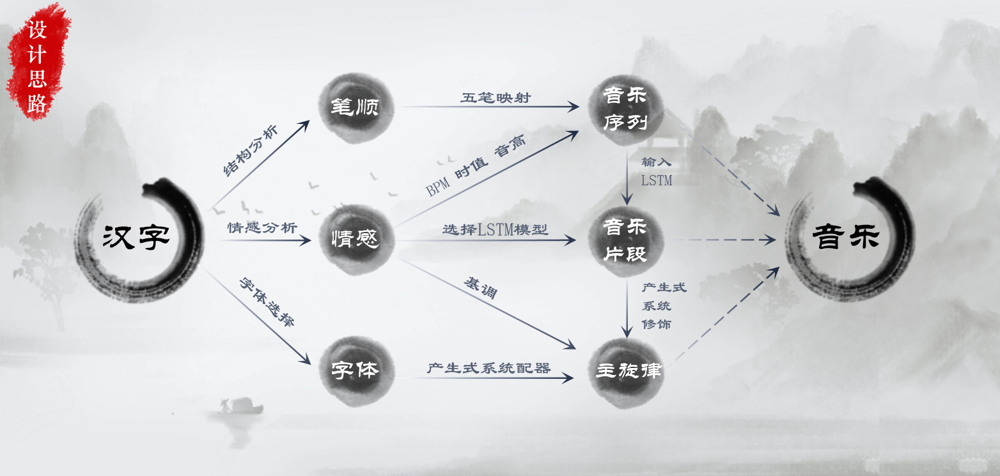

<h1 align="center">charamusic</h1>

## 介绍

- 汉字是白纸上画出的优美舞动的曲线，音乐是空间中演奏出的动听旋律；二者同为时序性的艺术，换个角度看，我们可以说音乐是流动的线条，汉字是凝固的旋律。那么我们设计作品的初衷便是将汉字和音乐两种艺术语言联系起来，运用计算机技术让汉字中凝固的旋律流动起来，通过音乐的律动来表达汉字的底蕴和文化。
- 我们作品的功能是，用户可以提交一段汉字文本，选择一种书法字体，便可以得到一段由中国传统乐器演奏的独特旋律，同时用户也可以下载文件进行二次创作。
- 我们作品的基本原理是，建立汉字和音乐的映射，搭建LSTM深度学习模型生成音乐片段，使用产生式系统连接音乐并搭配以民族乐器进行演奏

---

## 设计思路

我们通过分析一段汉字文本中的笔顺结构、文本情感和书法字体信息，实现汉字到音乐的转化。

从宏观的角度来看，在笔顺结构这里我们得到了音名序列，在文本情感这里我们用深度学习得到了音乐片段并连接修饰为主旋律，最后书法字体这里为主旋律配器，便得到了最终的音乐。

### 结构分析

任何汉字都可以由“横竖撇捺折”来书写，也就是五笔索引，我们将五笔和中国传统五声调式：“宫商角徵羽”对应起来。首先提取一段文本中能表达情感的汉字并转换为笔顺序列，再将笔顺序列映射为初始音名序列。

### 情感分析

- 我们分别对整个文本和每一小段进行情感分析，分为喜、哀和激昂三类，根据小段的情感为前面生成的初始音名序列赋予对应范围的BPM、音符时值和音符音高，比如欢快的情感会对应较快的BPM，较高的音高。这样我们便得到了一段音符序列，作为后续深度学习模型的输入。
- 然后我们将这段音符序列与对应的情感输入到**LSTM**中，LSTM根据情感调用对应的音乐生成模型，也就是我们这里训练好的喜、哀和激昂三中情感的网络权重文件，进行音乐续写，这样便得到了旋律感较强的音乐片段。
- 随后，我们根据中国民族曲式结构——起承转合的创作手法使用**产生式系统**对这一个个音乐片段进行连接修饰，比如说在承的部分用到倒影的手法，就是将某几小节的音符复制并倒序排列。这样连接修饰后便得到一段主旋律，再根据前面分析出的整句话的情感为主旋律确定基调。

### 字体的处理

我们提取了七种书法字体，在它们盛行的朝代提取出了七种民族乐器进行主旋律的演奏，同时在合适的位置加入其他的伴奏乐器与演奏手法，例如古筝古琴的滑音和轮指。来辅助主旋律延展，丰富听感。同样使用产生式系统，按照“弦索乐与丝竹乐”的搭配方式，多乐器进行齐奏或者重奏。

## 核心技术

单纯使用深度神经网络得到的音乐仅仅是AI对数据的模仿，缺少解释性与乐理的支撑。所以经过查阅大量的文献与自主实践，我们在深度学习的基础上使用产生式系统为AI加上乐理的约束与人类对音乐的理解。

### LSTM深度神经网络

我们搭建的**神经网络**包括输入层、词向量嵌入层、LSTM层、全连接层和输出层。**训练时**，语料从输入层进入网络，**在词向量嵌入层**转换为独热向量的形式，来屏蔽数字大小或者数字之间的距离对学习特征的影响。**在LSTM层**，它就是在这样一个细胞链上按照时序依次处理数据，学习音乐的规律。然后数据来到**全连接层**进行展平与反向传播。最后**输出层**输出结果，对数据进行温度采样，可以避免贪婪采样和随机采样导致的生成质量差或者旋律单一的问题。

### 产生式系统

通过慕课与书籍学习了基础乐理知识，自主构造了民乐创作的知识库。

仅仅把深度学习的结果当做材料，在上层用产生式系统在乐理的层面上对这些材料做一个推理修正。修正方式就是运用起承转合的手法去发展音乐，比如在承的部分有重复、模进、倒影等手法，在转的部分有节奏紧缩与节奏扩展等手法。这样得到一个主旋律，最后就对主旋律进行配器，赋予更丰富的听感就得到了一个作品。

## 注意事项

* 使用手写识别和情感分析功能时请先在：`backend\service\chara_service.py`中填充api密钥。

* 请在`backend\assets\china_sf2`文件中放入音源文件。音源文件下载地址：
  百度网盘：
  链接：https://pan.baidu.com/s/1oulgXqRy6_UWhe9KSCVpxg 
  提取码：qii7 

* 前端`YOURAPIIP:PORT`请自己部署后替换成自己服务器的IP（前端ip同理）。

  > 范围：前端各个页面，以及manifest.json

## 参考资料

### 乐理相关

* 基本乐理： https://www.bilibili.com/video/BV1RL411J7SA?p=2

### 音乐相关

* [MusicPyWiki](./musicpywiki/目录.md)
* 生成音乐：https://melobytes.com/en/app/melobytes-pro
* 生成音乐2：https://soundraw.io/
* 随机生成音乐：https://random-music-generators.herokuapp.com/melody
* 生成音乐的算法：https://www.bilibili.com/video/BV1BW411K7Ww/?spm_id_from=333.788.recommend_more_video.-1

### 其他

* 幕布： https://mubu.com/doc/5Tol3iaG7B7
* uniapp字体转换： https://www.cnblogs.com/mengsha/p/14039401.html
* 算法作曲：https://zhuanlan.zhihu.com/p/45904910

## Lincense

**GPL 2.0**
